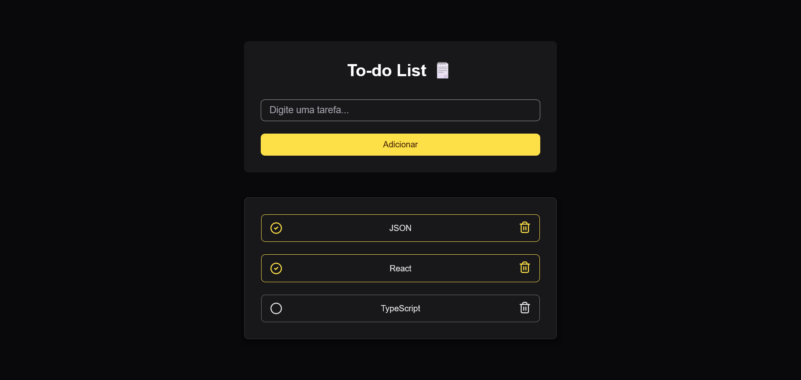

#  To-do List 🗒️

Uma aplicação web de lista de tarefas (To-do List) feita com **HTML**, **CSS** e **JavaScript**. Permite adicionar, marcar como concluída e remover tarefas. Os dados são salvos localmente no navegador com `localStorage`. 

## ✨ Funcionalidades

- ✅ Adicionar novas tarefas
- 📌 Marcar tarefas como concluídas
- 🗑️ Remover tarefas da lista
- 💾 Salvamento automático com `localStorage`
- 📱 Design responsivo e minimalista
- 🌗 Estilo moderno com ícones personalizados


## 🧠 Tecnologias usadas

- HTML5
- CSS3
- JavaScript (ES6+)
- `localStorage` para persistência de dados

## 📸 Preview


🔗 [Link da Demo](https://todo-list-tatyane-goncalves.vercel.app/)

## 🚀 Como rodar o projeto

1. Clone o repositório:
```bash
git clone https://github.com/tatyanepgoncalves/todo-list
```

2. Acesse a pasta de projeto
```bash
cd todo list
```

3. Abra o arquivo `index.html` no navegador.
Ou use uma extensão tipo Live Server no VS Code para facilitar.

## 📂 Estrutura do projeto

```
todo-list/
├── src/
│   ├──  images/
│   │    ├── circle-check.svg
│   │    ├── circle.svg
│   │    ├── trash-yellow.svg
│   │    └── trash.svg
│   ├── scripts/
│   │   └── index.js
│   └── styles/
│       └── style.css
├── index.html
└── README.md
```

## 🙋‍♀️ Autora
Feito com 💜 por Tatyane Gonçalves